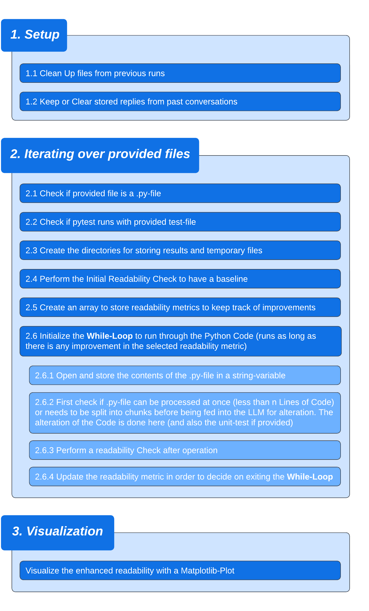

# Python Readability Enhancer with Test Validation

This Python-based tool is part of a Master Thesis and designed to automate the enhancement of readability in Python files, 
optionally incorporating unit tests to ensure code integrity post-enhancement.
By applying readability improvements with the help of a LLM using Autogen as an Orchestrator, it refines Python scripts to make them cleaner and more maintainable. 
The tool (optionally) not only processes individual Python files but also pairs them with their respective unit tests 
to verify that readability optimizations do not introduce errors or alter the intended functionality of the code. 

<table>
  <tr>
    <td align="center" valign="middle"></td>
    <td>
<strong><em>
    For a quick overview please check out the simplified Flowchart at the end of this File.
    </em></strong>
</td>
  </tr>
</table>

## 1. Set Up this Project:
- clone this repository to your local drive
- create a new .venv with python (Version: >= 3.8, <3.13) as the base interpreter. Here's a short [Video Tutorial](https://youtu.be/f4f7TYAHHvw)
- run the following command in the terminal within your IDE: `python -m pip install -r requirements.txt`

## 2. Running the Script

### 2.1 Configure 'main_config.py'
Inside this configuration-file only edit the variables that are listed in Chapter 1 (roughly first 30 Lines of Code)
- select a 'project_name' (it will later be used to create a directory inside 'your_projects_edit' to store the edited files as well 
as some temporary ones)
- set the 'use_gui' variable to 'True' in order to have the GUI displayed (currently not working)
- set the 'suppress_autogen_conversation' and 'suppress_miscellaneous_info' to 'True' in order to have less info in the console output
- set the 'oai_api_key' variable either directly in code or leave it empty and instead set it up as described in Chapter 2.2
- select a LLM-Model with the 'user_specified_llm' variable by setting it to either 0, 1 or 2
- provide the directories to the .py-files you want to be processed by this script inside the 
'directories_that_contain_files_to_be_modified' list
- (optionally) provide the directories to the test-.py-files you want to be used as unit tests for the verification 
of the changes made inside the 'directories_that_contain_test_files' list (Note: the order has to be the same as in the previous list)

#### 2.1.1 Extra Step: Set 'oai_api_key' as environment variable
This step is only necessary if the API Key has not been set directly in code as described in 4th Point in Chapter 2.1. 
The benefit of setting the API Key as an environment variable is that you will not accidentally Commit to GitHub with the API Key still
inside the Code for others to use it.
- Right-Click on 'This PC' or 'My Computer' on your desktop or inside File Explorer
- Select 'Properties'
- Click on 'Advanced system settings' to open the System Properties window
- In the System Properties window, go to the 'Advanced' tab
- Click on the 'Environment Variables' button
- Under 'System variables' (for all users) or 'User variables' (for your user only), click 'New'
- Create a new environment variable named `OPENAI_API_KEY`
- Enter your actual OpenAI API key as the variable value
- Click 'OK' to close all dialogs

## 3. Some Notes and Troubleshooting
### How to get an OpenAI API Key?
- Log into your OpenAI account and visit: [OpenAI API Keys](https://platform.openai.com/account/api-keys)
- As of 2023, the usage of API Services is not free. Make sure to deposit funds (at least $1) into your OpenAI account

### Important Security Note
- Keep your API keys and other sensitive information secure.
- Avoid exposing them in places where unauthorized users might access them.
- When distributing your code, ensure you're not including these keys directly in the code or in any files that might be shared publicly.

# Simplified Flowchart of the main.py-file

  

